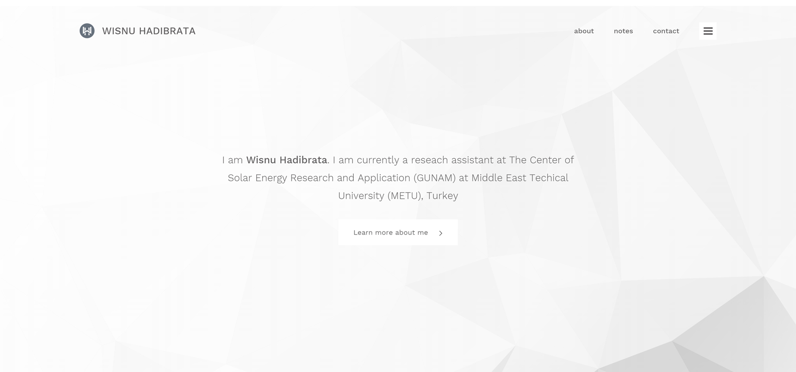
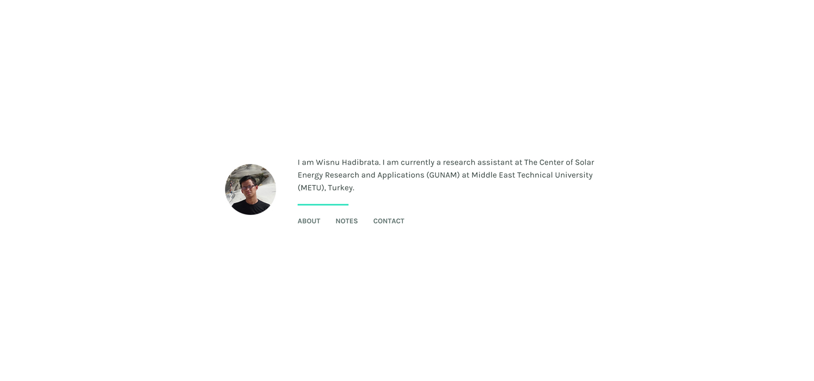

Well, I realized that the previous design of [personal website](../old-website/) was somehow not satisfying for myself. There were just too much things going on within the site. Inconsistency of design on different pages was one of them. I do still like the design though. Since it was my first design after all, I am still proud of it. Moving forward, I decided this time to design a much more simple site with only texts that matter and not much of images.

For the previous design, I followed too much today's mainstream design cues. A logo on the left top corner, a site navigation on the right top corner and a tagline in the center of the page followed by a call-to-action button.

I need something that differentiates me from others. And this time I am staying away from being a follower.

Here it is. A whole new design of my personal website. A much cleaner interface with only image of myself as well as the tagline with a simple navigation right at the bottom of it. I think I am liking the design for now. The previous design lasted for only a month. I hope this one will stay longer. Of course, this design is not finished yet. I might change couple of things later on without going away from the current design layout.
