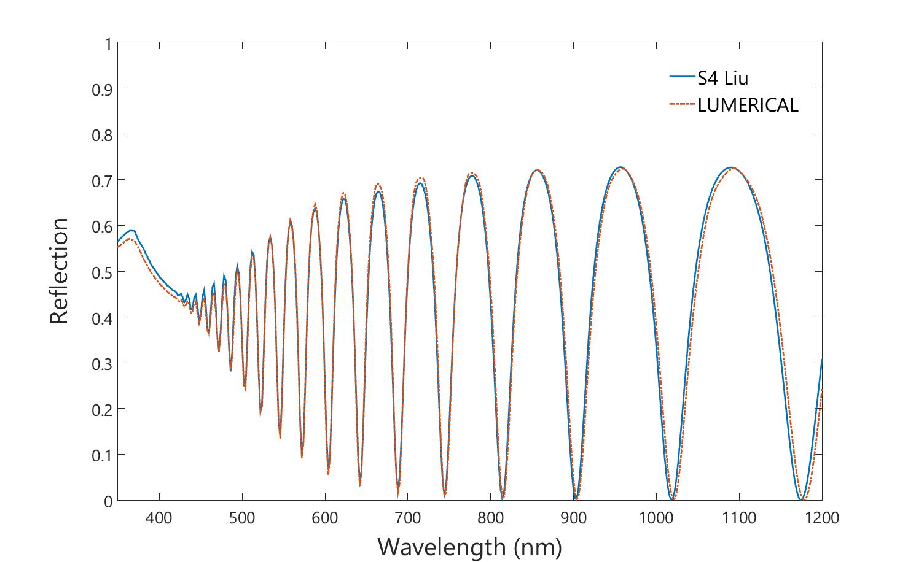
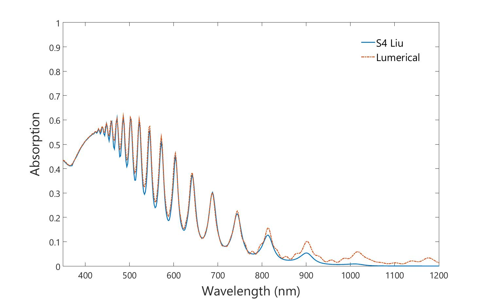

[S4](http://web.stanford.edu/group/fan/S4/) and [LUMERICAL FDTD](https://lumerical.com) are both great tools for optical simulations. While S4 uses Rigorous Coupled Wave Analysis (RCWA), LUMERICAL FDTD, as the name implies uses numerical analysis technique of Finite-difference time-domain (FDTD). S4 can be obtained free of charge from its original site while LUMERICAL FDTD provides 30 days free trial. With this in mind, I personally prefer to use S4 for quick assessment of optical profile of a structure.

To compare the two simulation tools, I have performed a simple simulation configuration consisting of 1 um thick silicon. To ensure that results from both tools show similar trend, the values of n and k of Silicon are the same for both tools. The values are originally taken from [PV Lighthouse](https://www.pvlighthouse.com.au). However, due to fitting of the curve implemented by LUMERICAL, a slight change in the values used by the tool is expected. The difference in the k values becomes very pronounce, especially in the near infra red region. As LUMERICAL cannot 100% fit the curve, the k values never goes to zero, unlike the original values which is also used in S4. This leads to relatively higher absorption in infra red region when compared to S4. This can be clearly seen on Figure 2. What this means is that while calculating the short-circuit current (Jsc), the calculated value from LUMEICAL will be slightly larger than Jsc from S4.

Figure 1. Reflection

Figure 2. Absorption

The difference in the Jsc is not large for the case of planar silicon. However, for a structure with relatively more complex geometry (sturcuted silicon), this difference is becoming more noticeable. This is also becoming more problematic if we want to do simulation in the infra-red region. For an intrinsic silicon, k value in this region is expected to be zero. But this is not true for simulation performed in LUMERICAL. There are definitely ways of avoiding this issues in LUMERICAL. Some might work very well while others might only work for a certain wavelength region.
